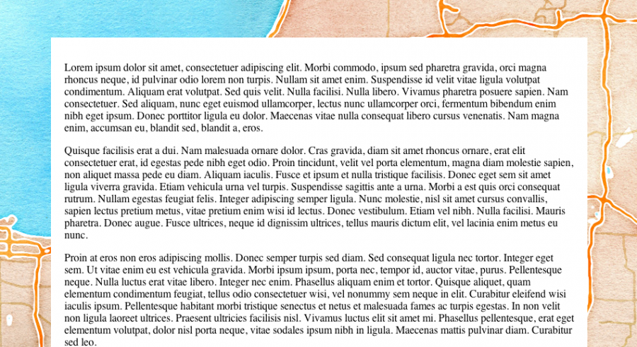

I was excited to see the <a href="http://drupalcampohio.org/">DrupalCamp Ohio site</a> launch recently with a very "road-trip" look and feel to the site. As someone who's really into mapping and travel, I think it's a great way to show a sense of exploration with your site. I especially like the nice touch of adding parallax scrolling to the background (http://dev.jonraasch.com/scrolling-parallax/), which gives it a great sense of depth.

But as I was submitting <a href="http://drupalcampohio.org/sessions/checking-mapping-drupal-7">my session</a>, I noticed that the implementation of the theme felt a little heavy and unpolished. The main culprit was the half-meg map image in the background. The background image easily took up half of the download bandwidth for the home page, which seems excessive. Also, it seemed fairly inflexible, since the image was of a fixed height, which might cause some issues later on down the road for longer pages like session listings.

In response, I decided to see if I could do a parallax scrolling map background using actual web mapping tools instead of a fixed image. This would provide some extra flexibility in display options, since one could theoretically display maps from any location in the background instead of just a single image, and it would potentially be lighter on bandwidth depending on how tall a page ends up being.

<!-- teaser -->

##The Tools

- <a href="http://modestmaps.com/">ModestMaps</a> - Since our map is going to be a background rather than the main focus of the page and interaction with the map would be practically nonexistent, I wanted the lightest mapping engine I could get my hands on.
- Custom tileset - I used the <a href="http://maps.stamen.com/watercolor">Stamen Maps watercolor tileset</a>, but any set that works with Modest Maps, including custom tilesets from Tilemill, will work.

##Implementation

At a glance, it appears that the entire page moves when scrolling up and down, but the trick to my particular implementation is that only the foreground actually moves. My background map div is actually held in place with some CSS <code>position: fixed</code> trickery. 

    .container {
      position: fixed;
      width: 100%; 
      height: 100%; 
      overflow: hidden;
      -webkit-touch-callout: none;
      -webkit-user-select: none; 
      -webkit-tap-highlight-color: rgba(0,0,0,0);
    }

Modest Maps actually does the scrolling within the map itself, which is controlled with scroll event listeners. To spice things up and show off a slightly more complicated use case, I take advantage of the HTML5 geolocation API to change the map location from a default to the user location.

    var map;
    var lastTop = 0;
      function loadMap() {
        var template = 'http://{S}.tile.stamen.com/watercolor/{Z}/{X}/{Y}.png';
        var subdomains = ['a', 'b', 'c'];
        var provider = new MM.TemplatedLayer(template, subdomains);
        map = new MM.Map('map', provider, undefined, []);
        var center = new MM.Location(41.5, -82.15);
        if (navigator.geolocation) {
          navigator.geolocation.getCurrentPosition(recenterMap);
        }
        map.setCenterZoom(center, 9);
      }

      function recenterMap(position) {
        var center = new MM.Location(position.coords.latitude, position.coords.longitude);
        map.setCenterZoom(center, 9);
      }

      $(window).scroll(function(e) {
        var currentScrollTop = $(window).scrollTop();
        var pan = lastTop - currentScrollTop;
        lastTop = currentScrollTop;

        // adjust the multiplier to adjust parallax effect. 1 = equal scroll.
        map.panBy(0, pan * 0.5);
      });

##Results

The <a href="http://fillerwriter.github.com/parallax-map-background/">final results</a> look great visually, but don't really solve some the page load issue from the original site. The home page for Drupalcamp Ohio clocks in at close to 1MB, while my test page loads in at a whopping 4.8MB! A lot of this has to do with the Stamen's watercolor tileset, which is just heavy and likely hard to optimize much more given the textures on the map. Other tilesets would likely not be so bandwidth-heavy.

Otherwise, the solution works very well. Because the background div never moves, the map should never run out of space on the bottom. Because the tiles are loaded piecemeal instead of one giant download, the solution suites itself well for other optimizations to decrease page-load time.